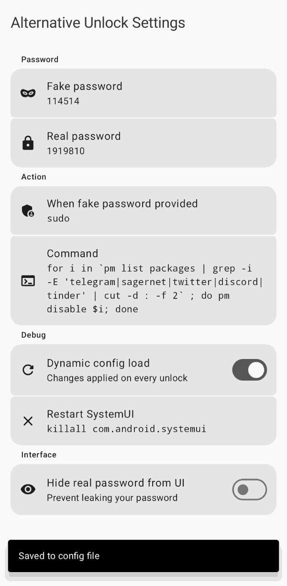
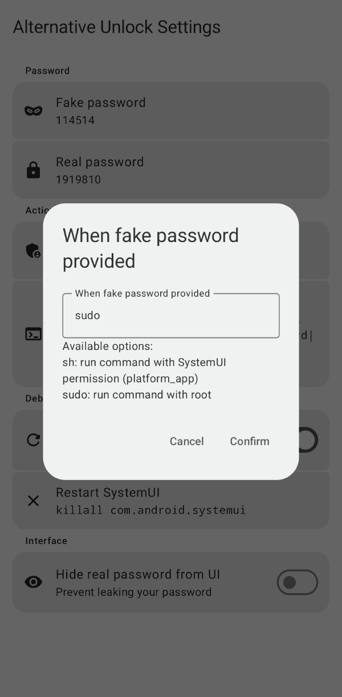

<image style="height:200px;display:inline" src="fastlane/metadata/android/en-US/images/icon.png" height="200px" />
<h1 align="center">AlternativeUnlockXposed</h1>
<small>

</small>
<b><i>
Unlock your Android phone with an alternative PIN (Xposed, Root)
</i></b>

This app provides a way to run something when providing a specific, secondary PIN on your lock screen.

Unlike [Duress](https://play.google.com/store/apps/details?id=me.lucky.duress&hl=en&gl=US), this app uses Xposed Framework so you can also unlock your phone with a *wrong* PIN, preventing some *social engineering vulnerabilities*😇 And it also works in BFU state.

> [!WARNING]
> This module *cannot* protect you from targeted attacks and/or forensics. You may need more security methods to deal with a complicated threat model.

## Features

- Alternative PIN to unlock phone
- Run command on alternative PIN, with root
- Easy to use user interface
- Material 3 Expressive design

Currently tested on:
- Android 15 (arm64, LOS 22.1)
- Android 14 (arm64)
- Android 13 (x86_64)
- Android 12 (x64_64)
- Android 11 (arm64, LOS 18.1)

Currently NOT working on:
- Android <= 10
- Samsung One UI
- OnePlus OxygenOS/ColorOS
- Tecno HiOS
- Most other non-AOSP

It *should* also work on other architectures

## How to use

- Install a root manager (Magisk, KernelSU, etc)
- Install an Xposed Manager (LSPosed, [Vector](https://github.com/JingMatrix/Vector))
- Install this module
- Activate this module in the Xposed manager and add the requested apps to the scope
- Launch AlternativeUnlockXposed, allow root access, set your primary (real) password and alternative password
- (optional) Setup what to do when entered the alternative PIN: change action to sudo, and set your command.
e.g. : ``for i in `pm list packages | grep -i -E 'telegram|sagernet|twitter|discord|tinder' | cut -d : -f 2` ; do pm disable $i; done``
- Test your unlock after click "Restart SystemUI"

> [!TIP]
> You can use automation software to make it easier to customize commands! just use a command like `am broadcast -a safety.intent.test` and catch the intent in your favorite app, it could be extended to do some stuff like take a picture, record audio, send a email, etc. like [Automate](https://llamalab.com/automate/). Note this kind of software can't work before unlock, so just make it an addition to your commands separated with a semicolon (`;`). 

If you are using this software, please consider to give it a star ⭐ on [Github](https://github.com/leohearts/AlternativeUnlockXposed) so we can know how many people are using it, since it doesn't contain any kind of tracking code.

## Download 

## Roadmap
- [x] Support PIN unlock
- [x] Run custom command on alternative PIN
- [x] User interface
- [ ] Run different commands on multiple fake password
- [x] Support more lockscreen modes
- [ ] Zygisk version (?)
- [ ] Require authentication for settings activity
- [ ] Option to hide the app from launcher ~~(I don't need it because I use SmartLauncher)~~

## Screenshots

 

## How does it work ?

When the fake password is provided, this module detects the input and replaces it with the real password. As a result, both the fake and real passwords can unlock the device, regardless of whether it is the first unlock or not.

Furthermore, since the fake password will be replaced with the real one, the fake password can also successfully decrypt the phone after a reboot.

## Credit

- [Duress](https://play.google.com/store/apps/details?id=me.lucky.duress&hl=en&gl=US) (for this idea)
- Google Bard (for app icon)
